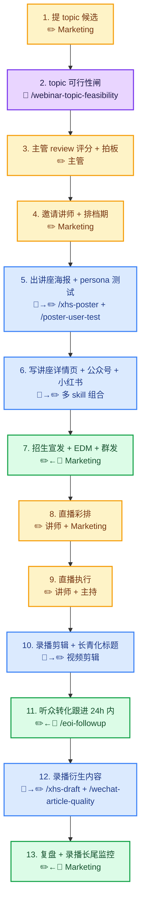
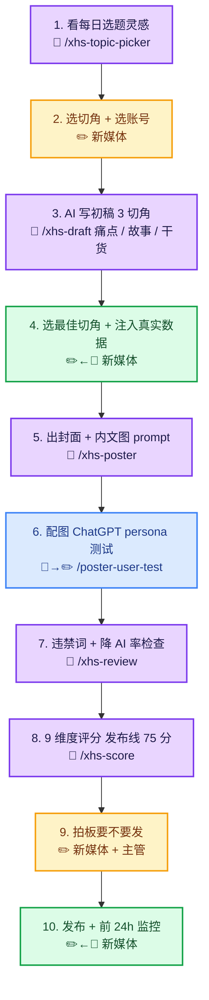
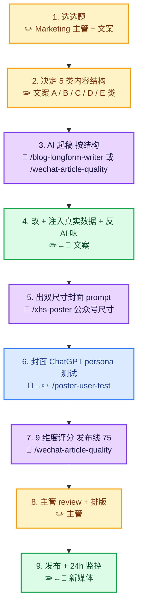
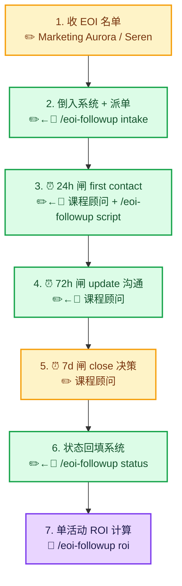
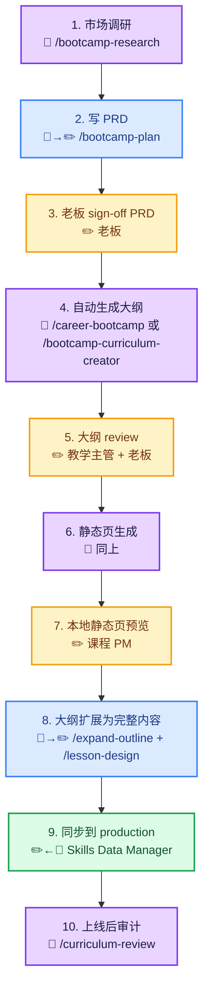
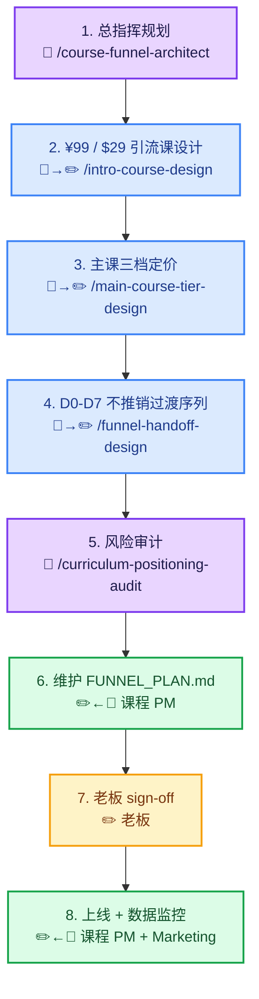
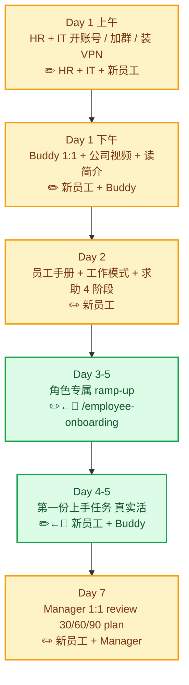
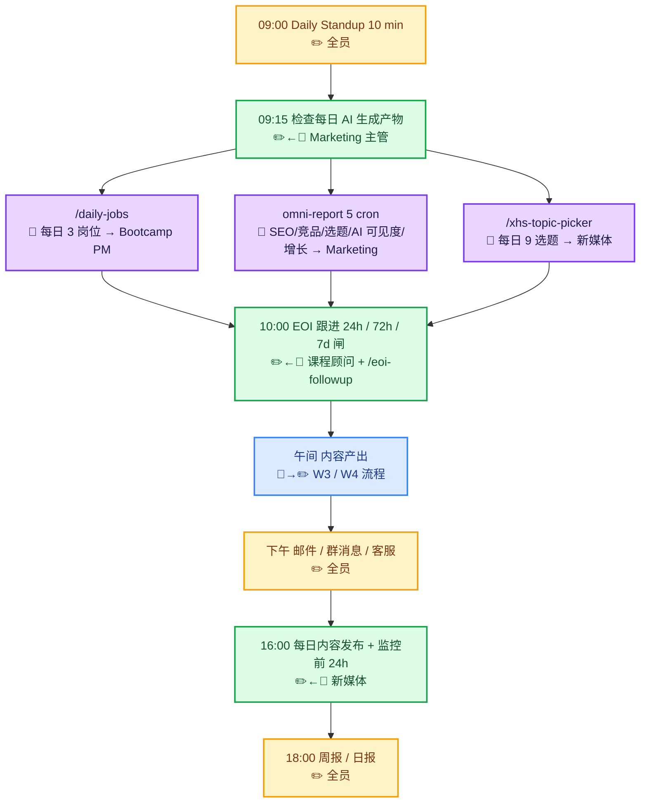

# 匠人学院 Skills Workflow 图谱（员工版）

> 给员工看的"做一件具体事，要走哪些步骤、哪些 AI 做、哪些人工做"的工作流图谱。
>
> **不是 skill 索引**（→ 看 [`docs/SKILLS_CATALOG.md`](../../../docs/SKILLS_CATALOG.md)，76 个 skill 按功能分 13 类）
> **不是入职清单**（→ 看本目录 [`SKILL.md`](./SKILL.md) + `reference/week-1-checklist.md`）
> **是工作场景 → 完整流程 + AI/人工分工**（本文档）

---

## 怎么用这个文档

1. 知道你今天要做什么事 → 找到对应 workflow（W1 - W9）
2. 跟着箭头一步步走，每步都标了「谁做 / 用什么 / 多久 / 产出什么」
3. AI 能做的步骤直接调 skill；人工的步骤自己干 / 找 buddy
4. 遇到红线（🚨 标记）必须停下确认，不能擅自跳过

---

## AI vs 人工 4 档分工标记

每个步骤都打了 1 个标记，员工看一眼就知道这步要不要 AI、要 AI 多深：

| 标记 | 含义 | 怎么用 |
|------|------|-------|
| 🤖 | **AI 全自动** | 调 skill → 直接拿结果，人工不参与判断 |
| 🤖→✏️ | **AI 起稿，人工 review** | 调 skill → AI 出 draft → 人工改关键内容 / 注入真实数据 / 拍板 |
| ✏️←🤖 | **人工为主，AI 辅助** | 人工主导决策 / 创作 / 沟通 → AI 当工具（评分 / 翻译 / 校对）|
| ✏️ | **纯人工** | 没有 AI 可以替代——决策 / 沟通 / 拍照 / 跑场地 / 跟客户聊 |

**核心心法**：AI 是杠杆不是替代。✏️ 那一档（人最贵）才是公司真正赚钱的部分。AI 把 🤖 / 🤖→✏️ 的事压缩到 10% 时间，省下的精力都用在 ✏️ 那一档——这就是为什么我们建立这套 skill 系统。

---

## 角色 → 你最需要的 workflow 速查

| 你是谁 | 必看 workflow |
|--------|--------------|
| **Marketing 通用** | W1 线下活动 / W2 线上讲座 / W3 小红书 / W4 公众号 / W5 EOI 跟进 / W9 每日运营 |
| **小红书运营** | W3 小红书 / W9 每日运营 |
| **内容策划 / 文案** | W3 / W4 / W2（写讲座宣发文） |
| **视频剪辑** | W2 步骤 10（录播剪辑） / W1 步骤 13（活动短视频）|
| **Sales / 课程顾问** | W5 EOI 跟进（必看）/ W2 步骤 11（讲座转化）|
| **课程运营** | W9 每日运营 / W2（讲座当天执行）|
| **课程 PM** | W6 设计新 Bootcamp / W7 设计漏斗 |
| **教学主管** | W6 步骤 5（大纲 review）/ W7（漏斗 sign-off）|
| **IT 辅导员** | W9 / W8 入职第一周 |
| **UI Designer** | W1 步骤 7（海报）/ W2 步骤 5（讲座海报）/ W3 步骤 5（小红书配图）|
| **Developer / 工程师** | W6 步骤 9（同步 production）/ W8 入职第一周 |
| **Career Coaching** | W2（讲座主讲）/ W5（EOI 跟进配合）|
| **新员工（任意岗位）** | W8 入职第一周（必看）|

---

# 9 个 Workflow

---

## W1：办一场线下活动（端到端）

📌 **触发**：要办一场线下活动（meetup / 招生说明会 / 学员 demo day / 行业沙龙）
👥 **主要参与人**：Marketing 主管 / Marketing / 活动统筹 / 摄影 / 课程顾问 / EA / 老板
⏱ **端到端时长**：3-4 周（从拍板到复盘 + EOI 跟进收尾）

### 流程图（17 步）

```mermaid
flowchart TD
    s1["1. 选活动 topic + 拍板<br/>✏️ Marketing 主管 + 老板"]:::manual
    s2["2. 写策划案<br/>🤖→✏️ /offline-event-content-design"]:::aiHuman
    s3["3. 策划案 review + 沙盘推演<br/>✏️ 主管 + 老板"]:::manual
    s4["4. 选场地 + 嘉宾邀请<br/>✏️ 活动统筹"]:::manual
    s5["5. 写活动详情页文章<br/>🤖→✏️ /offline-event-article-quality"]:::aiHuman
    s6["6. 详情页发到网站 + 报名表<br/>✏️←🤖 Marketing / 开发"]:::humanAi
    s7["7. 出宣发海报 prompt<br/>🤖 /xhs-poster"]:::ai
    s8["8. 海报 ChatGPT persona 测试<br/>🤖→✏️ /poster-user-test"]:::aiHuman
    s9["9. 写公众号宣发文章<br/>🤖→✏️ /wechat-article-quality"]:::aiHuman
    s10["10. 写小红书 5 篇切角<br/>🤖→✏️ /xhs-draft + /xhs-review + /xhs-score"]:::aiHuman
    s11["11. 招募 + 培训 EA + 物料<br/>✏️←🤖 /offline-event-sop"]:::humanAi
    s12["12. 活动当天执行<br/>✏️ 全员"]:::manual
    s13["13. 现场拍照 + 短视频素材<br/>✏️ 摄影 / 视频剪辑"]:::manual
    s14["14. 24h 内出 Recap 文章<br/>🤖→✏️ /offline-event-article-quality"]:::aiHuman
    s15["15. EOI 名单倒入 + 派单<br/>✏️←🤖 /eoi-followup intake"]:::humanAi
    s16["16. 24h / 72h / 7d 三道闸跟进<br/>✏️←🤖 /eoi-followup script + status"]:::humanAi
    s17["17. 单活动 ROI 计算<br/>🤖 /eoi-followup roi"]:::ai

    s1 --> s2 --> s3 --> s4 --> s5 --> s6 --> s7 --> s8 --> s9 --> s10 --> s11 --> s12 --> s13 --> s14 --> s15 --> s16 --> s17

    classDef ai fill:#e9d5ff,stroke:#7c3aed,color:#1e1b4b,stroke-width:2px
    classDef aiHuman fill:#dbeafe,stroke:#3b82f6,color:#1e3a8a,stroke-width:2px
    classDef humanAi fill:#dcfce7,stroke:#16a34a,color:#14532d,stroke-width:2px
    classDef manual fill:#fef3c7,stroke:#f59e0b,color:#78350f,stroke-width:2px
```



### 详细分工

| # | 步骤 | 谁做 | 分工 | 用什么 | 时长 | 产出 |
|---|------|------|-----|--------|------|------|
| 1 | 选活动 topic + 拍板 | Marketing 主管 + 老板 | ✏️ | 业务直觉 + 季度计划 | 1 day | 1 句话 topic 定稿 |
| 2 | 写策划案（8 框架） | Marketing | 🤖→✏️ | `/offline-event-content-design` | 1-2 day | 完整策划案 PDF / Notion |
| 3 | 策划案 review | 主管 + 老板 | ✏️ | 100 分量表打分 | 30 min | 是 / 否 / 改清单 |
| 4 | 选场地 / 嘉宾 / 时间 | 活动统筹 | ✏️ | 询价 + 嘉宾沟通 | 1-2 周 | 场地确认书 + 嘉宾确认 |
| 5 | 写详情页文章 | Marketing | 🤖→✏️ | `/offline-event-article-quality`（5 心法 + 8 维度） | 半天 | Notion 写作（很多配图）|
| 6 | 详情页上线 | Marketing / 开发 | ✏️←🤖 | Notion → 网站读取 + 报名表 | 1h | 网站 URL + 报名链接 |
| 7 | 出海报 prompt | Marketing | 🤖 | `/xhs-poster` | 30 min | 3-5 版海报 prompt |
| 8 | **海报 persona 测试** | Marketing | 🤖→✏️ | `/poster-user-test`（**ChatGPT**） | 10 min/版 | 推导分 + 用户原话反馈 |
| 9 | 写公众号宣发 | Marketing | 🤖→✏️ | `/wechat-article-quality`（C 类） | 半天 | 发布前 9 维度 ≥ 75 分 |
| 10 | 写小红书 5 篇 | Marketing / 新媒体 | 🤖→✏️ | `/xhs-draft` + `/xhs-review` + `/xhs-score` | 1 day | 5 篇切角各 ≥ 75 分 |
| 11 | EA + 物料 + SOP | 活动统筹 | ✏️←🤖 | `/offline-event-sop`（6 阶段） | 1 周 | 物料 checklist + EA 培训 |
| 12 | 活动执行 | 全员 | ✏️ | 现场 | 3-4 h | 签到表 + EOI 表 + 现场反馈 |
| 13 | 拍照 / 短视频 | 摄影 / 视频剪辑 | ✏️ | 相机 / 手机 + 剪辑 | 现场 + 1-2 day | 高清照片 + 30s 短视频 |
| 14 | Recap 复盘文章 | Marketing | 🤖→✏️ | `/offline-event-article-quality`（D 类故事） | 1 day | 公众号 / 小红书 / 网站 |
| 15 | EOI 名单倒入 | Marketing | ✏️←🤖 | `/eoi-followup` intake mode | 1h | 系统 lead 卡片 + 派单 |
| 16 | 24h/72h/7d 跟进 | 课程顾问 | ✏️←🤖 | `/eoi-followup` script + status | 7 day | 状态回填 + 转化记录 |
| 17 | ROI 计算 | Marketing 主管 | 🤖 | `/eoi-followup` roi mode | 30 min | 单活动 ROI 报告归档 |

🔑 **关键产出**：
- 策划案 + 详情页 + 5 篇宣发内容 + 复盘文章
- EOI 名单 + 跟进记录 + 转化数据
- ROI 报告（用于下次同类活动决策）

🚨 **红线**：
- ❌ **不能承诺金钱结果**（"包就业 / 月入"）—— W1 全流程都禁
- ❌ 海报 / 详情页**意思表达不清** → 步骤 8 持续打回直到 persona 都看懂
- ❌ EOI 24h 内**没有 first contact** → 触发 SLA 违约（参考 `/eoi-followup`）
- ❌ 拍照 **没拿到学员肖像授权** → 不能用于宣发

💥 **翻车实例**：
- 2025 Q4 一场活动 EOI 名单 7 天没派单，到第 8 天才跟进，转化率从历史 22% 掉到 5%
- 某次海报"AI 改变留学生命运"过于煽情，详情页 5 心法不及格 → 报名 60 但出席 12

---

## W2：办一场线上讲座（端到端）

📌 **触发**：要办一场线上 webinar / 直播分享 / Zoom 公开课
👥 **主要参与人**：Marketing 主管 / Marketing / 讲师 / 视频剪辑 / 课程顾问
⏱ **端到端时长**：2-3 周（从选 topic 到录播长尾上线）

### 流程图（13 步）



### 详细分工

| # | 步骤 | 谁做 | 分工 | 用什么 | 时长 | 产出 |
|---|------|------|-----|--------|------|------|
| 1 | 提 topic 候选 | Marketing | ✏️ | 直觉 + 用户三圈痛点 | 30 min | 1-5 个候选 topic |
| 2 | topic 可行性闸 | Marketing | 🤖 | `/webinar-topic-feasibility` | 30 min | 评分 + 标题强度 + 必改清单 |
| 3 | 主管 review | 主管 | ✏️ | 评分阈值（80/60/<60）| 15 min | 决策 |
| 4 | 邀请讲师 | Marketing | ✏️ | 沟通 + 排档期 | 1-3 day | 讲师确认书 |
| 5 | 海报 + persona 测试 | Marketing | 🤖→✏️ | `/xhs-poster` + `/poster-user-test` | 1h | 海报 ≥ 80 分版本 |
| 6 | 详情页 + 宣发文 | Marketing | 🤖→✏️ | `/offline-event-article-quality` + `/wechat-article-quality` + `/xhs-*` | 1-2 day | 1 详情页 + 1 公众号 + 5 小红书 |
| 7 | 招生宣发 | Marketing | ✏️←🤖 | EDM 模板 + 群发 | 持续 1 周 | 报名数 |
| 8 | 直播彩排 | 讲师 + Marketing | ✏️ | Zoom 测试 + 串场 | 1h | 讲师感觉 OK |
| 9 | 直播执行 | 讲师 + 主持 | ✏️ | Zoom + 直播间 | 1-1.5h | 录播原片 + 互动数据 |
| 10 | 录播剪辑 + 长青化 | 视频剪辑 | 🤖→✏️ | 剪辑软件 + 章节标 + 长青版标题 | 1-2 day | YouTube + B 站 + 网站长尾页 |
| 11 | 转化跟进 24h | 课程顾问 | ✏️←🤖 | `/eoi-followup` script | 1-2 day | 每个报名留言 + 试听课派发 |
| 12 | 衍生内容拆解 | Marketing | 🤖→✏️ | `/xhs-draft` + `/wechat-article-quality` | 1 周 | 1 公众号长文 + 5 小红书 + 1 Bootcamp lesson 素材 |
| 13 | 复盘 + 长尾监控 | Marketing | ✏️←🤖 | 数据后台 + 录播观看曲线 | 持续 1 个月 | ROI + 长尾价值评估 |

🔑 **关键产出**：
- 讲座本身（直播 + 录播）
- 衍生内容矩阵（公众号 / 小红书 / Bootcamp 素材）
- 报名转化数据 + 录播长尾观看数据

🚨 **红线**：
- ❌ topic 评分 < 60 仍坚持做 → 浪费宣发预算 + 损害用户对 JR 讲座的信任
- ❌ **标题双低**（钩子 + 透明度都 < 50%）→ 报名数会让你怀疑人生
- ❌ 嘉宾承诺金钱结果（"我有学员月入 X 万"）→ 直播间立刻撤换话题
- ❌ 讲座结束 24h 内**没有跟进** → 转化率掉一半

💥 **翻车实例**：
- 一场叫《AI 时代如何提升职业竞争力》的讲座（参考 `webinar-topic-feasibility/reference/flunked-sample.md`）报名 28 人 / 出席 6 / 转化 0
- 某场 GPT 改简历的讲座（91 分推导）报名 480 / 出席 165 / 试听课转化 12 → 之后衍生 5 篇小红书 + 1 公众号长文持续引流 3 个月

---

## W3：写一篇小红书（从选题到发布）

📌 **触发**：每天 / 每周需要发小红书内容
👥 **主要参与人**：新媒体（Summer / Lily / KIKI / 文案）/ Marketing 主管
⏱ **端到端时长**：1.5-3 小时 / 篇

### 流程图（10 步）



### 详细分工

| # | 步骤 | 谁做 | 分工 | 用什么 | 时长 | 产出 |
|---|------|------|-----|--------|------|------|
| 1 | 看每日选题 | 新媒体 | 🤖 | `/xhs-topic-picker`（每日 9 个候选） | 5 min | 选题清单 |
| 2 | 选切角 + 账号 | 新媒体 | ✏️ | 11 账号 routing-table | 5 min | topic + account 配对 |
| 3 | AI 写初稿 3 切角 | 新媒体 | 🤖 | `/xhs-draft` | 10 min | 3 版初稿（痛点 / 故事 / 干货）|
| 4 | 选切角 + 注入真实数据 | 新媒体 | ✏️←🤖 | 真实学员故事 / 平台数据 | 30-60 min | 03-final.md（员工 copy 用） |
| 5 | 出封面 + 内文图 prompt | 新媒体 | 🤖 | `/xhs-poster`（手动模式默认） | 10 min | 3 封面 + 4 内文图 prompts |
| 6 | **配图 persona 测试** | 新媒体 | 🤖→✏️ | `/poster-user-test`（ChatGPT） | 10 min | 推导分 + 用户原话 |
| 7 | 违禁词 + 降 AI 率 | 新媒体 | 🤖 | `/xhs-review` | 5 min | 04-review.md（红线检查 + 降 AI 率改写） |
| 8 | 9 维度评分 | 新媒体 | 🤖 | `/xhs-score` | 5 min | 05-score.md（发布线 75）|
| 9 | < 75 改 / ≥ 75 通过 | 新媒体 + 主管 | ✏️ | 阈值判断 | 5-30 min | marketing-tasks 卡（status=ready）|
| 10 | 发布 + 监控 | 新媒体 | ✏️←🤖 | 小红书 app + 后台数据 | 持续 1 day | 真实数据 → published/ 归档 |

🔑 **关键产出**：
- `xhs-content-factory/drafts/{date}/{topic-id}-{account}/` 完整 7 文件
- 自动派单 marketing-task 卡
- 发布数据 + 评论 / 涨粉 / 引流

🚨 **红线**：
- ❌ 评分 < 75 强行发 → 拖低账号权重，得不偿失
- ❌ 截图 / 数据 **造假**（"3 周拿 6 个面试" 但学员根本没拿到）
- ❌ 触违禁词（已经在 `/xhs-review` 检查表里）→ 限流
- ❌ 配图渠道错配（公众号封面尺寸用到小红书）

💥 **翻车实例**：
- 一篇 81 分的真实 demo（Rain 姐说求职）成功跑通 9 文件 pipeline → 派单 + 评分 + 发布 → admin UI 工作目录文件预览右栏 dogfood 跑通

---

## W4：写一篇公众号（从选题到发布）

📌 **触发**：每周 2-3 篇公众号文章
👥 **主要参与人**：新媒体 / 文案策划 / Marketing 主管
⏱ **端到端时长**：1-2 day / 篇

### 流程图（9 步）



### 详细分工

| # | 步骤 | 谁做 | 分工 | 用什么 | 时长 | 产出 |
|---|------|------|-----|--------|------|------|
| 1 | 选选题 | 主管 + 文案 | ✏️ | 周计划 + 热点 | 30 min | 选题 + 角度 |
| 2 | 决定 5 类结构 | 文案 | ✏️ | A/B/C/D/E 5 类对应结构 | 10 min | 大纲（按类型走） |
| 3 | AI 起稿 | 文案 | 🤖 | `/blog-longform-writer` 或 `/wechat-article-quality` | 30 min | 1800-3000 字初稿 |
| 4 | 改 + 注入真实数据 | 文案 | ✏️←🤖 | 真实案例 + 平台数据 + 反 AI 味 | 2-4 h | 终稿 |
| 5 | 出双尺寸封面 | 文案 | 🤖 | `/xhs-poster` 公众号尺寸 | 15 min | 大图 + 小图 prompt |
| 6 | 封面 persona 测试 | 文案 | 🤖→✏️ | `/poster-user-test`（ChatGPT） | 10 min | 推导分 + 改进建议 |
| 7 | 9 维度评分 | 文案 | 🤖 | `/wechat-article-quality` | 10 min | 评分报告（≥ 75 通过）|
| 8 | 主管 review + 排版 | 主管 | ✏️ | 手机预览 + 微信合规检查 | 30 min | 发布版本 |
| 9 | 发布 + 监控 | 新媒体 | ✏️←🤖 | 公众号后台 | 持续 24h | 打开率 / 完读率 / 在看 |

🔑 **关键产出**：
- 公众号文章（≥ 75 分发布）
- 双尺寸封面（缩略图字号合规）
- 24h 后数据（决定衍生内容）

🚨 **红线**：
- ❌ 模板化开头（"在当今快速发展的 / 至关重要"）→ 直接降权
- ❌ 极限词 / 集赞拉群 / 医疗金钱保证 → 微信合规扣分（重）
- ❌ 标题党（钩子 ≠ 内容）→ 完读率低 + 用户取关
- ❌ 用 AI 写完不改 → AI 味重，反作用

💥 **翻车实例**：
- 一篇模板化"AI 时代职业竞争力"打开率 1.2%（账号均值 5%），下一篇换具体话题恢复

---

## W5：EOI 销售跟进（活动后）

📌 **触发**：线下活动 / 线上讲座结束，收到 EOI 报名表
👥 **主要参与人**：Marketing 主管 / 课程顾问（Amelia / Rain / Angela）/ Beta 教务
⏱ **端到端时长**：7-14 day / 名单（按 SLA 闸）

### 流程图（7 步）



### 详细分工

| # | 步骤 | 谁做 | 分工 | 用什么 | 时长 | 产出 |
|---|------|------|-----|--------|------|------|
| 1 | 收 EOI 名单 | Marketing（Aurora/Seren）| ✏️ | 活动表单 / 现场 EOI 表 | 当晚 | 原始名单（姓名 / 联系方式 / 兴趣）|
| 2 | 倒入系统 + 派单 | Marketing | ✏️←🤖 | `/eoi-followup` intake mode | 1h | `curriculum/events/{slug}/eoi.json` + 派给 3 个顾问 |
| 3 | **24h first contact** | 课程顾问 | ✏️←🤖 | `/eoi-followup` script mode（4 mode 之一） | 24h SLA | 微信 / 电话首联记录 |
| 4 | 72h update | 课程顾问 | ✏️←🤖 | 同上 | 72h SLA | 二次跟进 + 试听 / 资料发送 |
| 5 | 7d close | 课程顾问 | ✏️ | 业务直觉 + 客户反馈 | 7d SLA | 成交 / 不成 / 延后理由 |
| 6 | 状态回填 | 课程顾问 | ✏️←🤖 | `/eoi-followup` status mode | 5 min/lead | 系统状态更新 |
| 7 | ROI 计算 | Marketing 主管 | 🤖 | `/eoi-followup` roi mode | 30 min | 单活动成本 / 转化 / 客单价报告 |

🔑 **关键产出**：
- `curriculum/events/{slug}/eoi.json`（单一真相）
- 每个 lead 的状态机（pending → contacted → engaged → closed/lost）
- 单活动 ROI 报告

🚨 **红线**：
- ❌ **24h 内没有 first contact** → SLA 违约，转化率掉一半
- ❌ **群发模板话术**（"亲爱的同学..."群发）→ 用户立刻识别为推销，反感
- ❌ 课程顾问承诺**金钱结果**（"包就业 / 月入 X"）→ 三票否决（监管 + 体面 + 信任）
- ❌ 系统状态没回填 → 下次同人投另一场活动重复联系

💥 **翻车实例**：
- 一场 80 人 EOI 的活动，因为 7 天没派单，到第 10 天才跟进，最终转化 4 单 → 同期类似活动正常跟进转化 18 单
- 某课程顾问群发"包就业"话术被用户截图发小红书 → 公司紧急改了所有话术模板

---

## W6：设计一个新 Bootcamp（从市场调研到上线）

📌 **触发**：要新开一个 Bootcamp（如 Career Bootcamp / Cloud / AI Engineer）
👥 **主要参与人**：课程 PM / 教学主管 / 老板 / 开发
⏱ **端到端时长**：3-6 周

### 流程图（10 步）



### 详细分工

| # | 步骤 | 谁做 | 分工 | 用什么 | 时长 | 产出 |
|---|------|------|-----|--------|------|------|
| 1 | 市场调研 | 课程 PM | 🤖 | `/bootcamp-research` | 1-2 day | 竞品报告 + 需求验证 |
| 2 | 写 PRD | 课程 PM | 🤖→✏️ | `/bootcamp-plan` | 1-3 day | PRD 文档 |
| 3 | sign-off PRD | 老板 | ✏️ | 商业判断 | 1h | 是 / 否 / 改 |
| 4 | 生成大纲 | 课程 PM | 🤖 | `/career-bootcamp` 或 `/bootcamp-curriculum-creator` | 1 day | `curriculum/{slug}/public/outline.json` |
| 5 | 大纲 review | 教学主管 + 老板 | ✏️ | 教学法 + 业务直觉 | 2-3 day | 改完版本 |
| 6 | 静态页生成 | 课程 PM | 🤖 | 同 4 | 自动 | `curriculum/{slug}/public/*.html` |
| 7 | 本地预览 | 课程 PM | ✏️ | 浏览器 | 1h | 视觉 / 文案确认 |
| 8 | 扩展完整内容 | 课程 PM | 🤖→✏️ | `/expand-outline` + `/lesson-design` | 1-2 周 | 每节 lesson 完整内容 |
| 9 | 同步 production | 课程 PM | ✏️←🤖 | Skills Data Manager `/bootcamp` 页 | 30 min | production lesson + bootcamp |
| 10 | 上线后审计 | 课程 PM | 🤖 | `/curriculum-review` | 1h | 缺口报告 + 修复 |

🔑 **关键产出**：
- `curriculum/{slug}/` 完整工作区（PRD + outline + 静态页 + lesson 内容）
- production 上的 Bootcamp + 所有 lesson
- 上线后审计报告

🚨 **红线**：
- ❌ **省略市场调研** 直接写 PRD → 经常做出"自己觉得好但市场不要"的课
- ❌ **跳过本地预览** 直接 sync production → 翻车风险大（错字 / 视觉错位）
- ❌ Bootcamp **没有付费漏斗**（W7）就上线 → 学员单向流失，转化路径缺
- ❌ 用 ID-First 原则：lesson 关联**用 ObjectId 不用 slug**（参考全局 CLAUDE.md）

💥 **翻车实例**：
- 一个 Bootcamp 没做市场调研直接做完上线，3 个月报名 2 单
- 某课程 lesson 用 slug 关联导致 prod / dev 数据不一致，紧急切回 ObjectId

---

## W7：设计课程付费漏斗（引流课 + 主课三档 + 7 天过渡）

📌 **触发**：W6 完成的 Bootcamp 没有付费漏斗 / 已上线 Bootcamp 转化差要补漏斗
👥 **主要参与人**：课程 PM / Marketing 主管 / 老板
⏱ **端到端时长**：1-2 周

### 流程图（8 步）



### 详细分工

| # | 步骤 | 谁做 | 分工 | 用什么 | 时长 | 产出 |
|---|------|------|-----|--------|------|------|
| 1 | 总指挥规划 | 课程 PM | 🤖 | `/course-funnel-architect` | 30 min | FUNNEL_PLAN.md 骨架 |
| 2 | 引流课设计 | 课程 PM | 🤖→✏️ | `/intro-course-design` | 2-3 day | ¥99 课大纲 + quick win 闭环 |
| 3 | 主课三档 | 课程 PM | 🤖→✏️ | `/main-course-tier-design` | 1 day | 自学 / 教学 / 陪跑三档大纲 + 定价 |
| 4 | 7 天过渡序列 | 课程 PM | 🤖→✏️ | `/funnel-handoff-design` | 1 day | D0-D7 邮件 + 服务序列 |
| 5 | 风险审计 | 课程 PM | 🤖 | `/curriculum-positioning-audit` | 1h | 翻车风险 + 修复建议 |
| 6 | 维护 FUNNEL_PLAN | 课程 PM | ✏️←🤖 | 单一真相文档 | 持续 | `curriculum/{slug}/FUNNEL_PLAN.md` |
| 7 | 老板 sign-off | 老板 | ✏️ | 商业判断 | 1h | 是 / 否 / 改 |
| 8 | 上线 + 监控 | 课程 PM + Marketing | ✏️←🤖 | 数据后台 | 持续 1 个月 | 引流 → 主课转化率 |

🔑 **关键产出**：
- `curriculum/{slug}/FUNNEL_PLAN.md`（单一真相文档）
- 引流课上线 + 三档主课 + 7 天序列
- 转化率监控数据

🚨 **红线**：
- ❌ 引流课 = 主课试听片段 → quick win 闭环失败，用户买完没动力升级
- ❌ 7 天过渡用**推销轰炸**（每天发课程广告）→ 用户取关
- ❌ 三档定价**只按内容多少分级**（自学版少课主课多课）→ 应该按"承诺什么结果"分级
- ❌ 没用 `/curriculum-positioning-audit` 体检 → 上线后翻车

💥 **翻车实例**：
- ai-marketing 课程的 FUNNEL_PLAN dogfood 范例（参考 `curriculum/ai-marketing/FUNNEL_PLAN.md`）

---

## W8：新员工入职第一周（按 12 角色变种）

📌 **触发**：每个新员工入职 Day 1
👥 **主要参与人**：新员工 / Buddy / Manager / HR / IT
⏱ **端到端时长**：7 day

### 流程图（通用 6 步 + 角色专属 ramp-up）



### 12 角色专属 ramp-up（Day 3-5）

| 你的岗位 | 优先看哪个 workflow | 必读 skill |
|---------|-------------------|-----------|
| Marketing 通用 | W1 / W2 / W3 / W4 / W5 / W9 | `employee-onboarding` 角色页 marketing.md |
| 小红书运营 | W3 / W9 | `xhs-topic-picker` / `xhs-draft` / `xhs-review` / `xhs-score` 全套 |
| 内容策划 / 文案 | W3 / W4 / W2 步骤 6 | `wechat-article-quality` / `blog-longform-writer` |
| 视频剪辑 | W2 步骤 10 / W1 步骤 13 | 现有视频系统（独立 repo `jr-academy-videos`）|
| Sales / 课程顾问 | W5 全部 / W2 步骤 11 | `eoi-followup` 4 mode 全套 |
| 课程运营 | W9 / W2 步骤 9 | `daily-jobs` |
| 课程 PM | W6 全部 / W7 全部 | `bootcamp-plan` / `bootcamp-research` / `course-funnel-architect` |
| 教学主管 | W6 步骤 5 / W7 步骤 7 | `lesson-design` / `curriculum-review` |
| IT 辅导员 | W9 / W8 入职跟进 | 学员服务文档 |
| UI Designer | W1 步骤 7 / W2 步骤 5 / W3 步骤 5 | `xhs-poster` + Canva 培训 |
| Developer / 工程师 | W6 步骤 9 / 项目代码规范 | `unit-test` / `pre-commit-check` / 全局 CLAUDE.md |
| Career Coaching | W2 / W5 配合 | `eoi-followup` |

🔑 **关键产出**：
- Day 1 账号 / 群全开（IT checklist 完成）
- Day 7 第一份周报 + 30/60/90 plan
- 角色专属技能 ramp-up 完成

🚨 **红线**：
- ❌ Day 1 还没装 VPN → IT 流程没走对，全员都焦虑
- ❌ 第一周不联系 Buddy 自己闷头看文档 → Manager 觉得"不主动"
- ❌ 上手任务交不出来还不求助 → 违反求助 4 阶段（阻塞 1h 必须求助）
- ❌ 跳过 W8 直接做 W3 / W4 → 还没读员工手册就触发请假 / 报销流程，HR 流程崩

💥 **翻车实例**：
- 某新人第一周自己看文档不联系 Buddy，Day 7 review 时 Manager 完全不知道他在干嘛 → 试用期延长

---

## W9：每日运营（marketing / 课程运营每天必做）

📌 **触发**：每个工作日上班
👥 **主要参与人**：Marketing / 课程运营 / 课程顾问
⏱ **每天**：1-2 小时（不含创作）

### 流程图（7 步 + 中段 3 路 AI 产物分流）



（注：上面的"每日 daily 日报不强制"原版备注已并入 step 7）
       │ ✏️ 全员
```

### 详细分工

| 时段 | 步骤 | 谁做 | 分工 | 用什么 | 时长 | 产出 |
|------|------|------|-----|--------|------|------|
| 09:00 | Daily standup | 全员 | ✏️ | 站会模板 | 10 min | 同步昨天 / 今天 / 阻塞 |
| 09:15 | 检查每日 AI 产物 | Marketing 主管 | ✏️←🤖 | `/daily-jobs` + omni-report cron + `/xhs-topic-picker` | 20 min | 任务派单 |
| 10:00 | EOI 跟进 | 课程顾问 | ✏️←🤖 | `/eoi-followup` script + status | 1-2 h | 跟进记录 |
| 午间 | 内容产出 | Marketing / 新媒体 | 🤖→✏️ | W3 / W4 流程 | 1-3 h | 每日内容 |
| 下午 | 邮件 / 客服 | 全员 | ✏️ | 邮箱 + 微信 | 持续 | 客户响应 |
| 16:00 | 内容发布 + 监控 | 新媒体 | ✏️←🤖 | 小红书 / 公众号 app | 30 min | 发布 + 数据监控 |
| 18:00 | 周报（每周）| 全员 | ✏️ | 公司模板 | 30 min | 周报提交 |

🔑 **关键产出**：
- 每日 daily standup 同步
- 每天的内容发布 + 监控数据
- EOI 跟进记录 + 状态回填

🚨 **红线**：
- ❌ Daily standup 不参加 → 团队失同步
- ❌ EOI 24h SLA 没满足 → 转化率受损（参考 W5 红线）
- ❌ 群消息 / 邮件不回 → Manager 评估"不融入"的最直接信号
- ❌ AI 产物当天没看 → 选题 / 岗位推荐都浪费了

💥 **翻车实例**：
- 某 marketing 一周不看运营中心 dashboard，错过 5 个高分选题机会 + 漏 12 个候选岗位

---

# 红线总表（cross-cutting）

> 跨所有 9 个 workflow 都适用的红线。任何 workflow 任何步骤违反这些都要停下。

| # | 红线 | 适用范围 | 后果 |
|---|------|---------|------|
| 1 | **课程承诺红线**（禁说"月入 / 副业 / 包就业 / 保 offer / 保过 / 包薪 / 兼职变现"）| W1-W9 全部 | 三票否决（监管 + 体面 + 信任）|
| 2 | **资质红线**（不碰移民身份具体建议 / 医疗 / 投资 / 税务） | W1-W9 全部 | 法律风险 |
| 3 | **反 AI 味红线**（"在当今 / 至关重要 / 深入探讨 / 把握机遇 / 全面掌握"）| W2-W4 内容创作类 | Google / 微信降权 + 用户一眼识破 |
| 4 | **真实数据红线**（学员故事 / 数字必须可验证）| W1-W4 | 课程承诺红线擦边 |
| 5 | **24h SLA 红线**（活动结束后 EOI 24h 必须 first contact）| W5 | 转化率掉一半 |
| 6 | **意思表达准确红线**（海报 / 标题 5 秒内能让用户答出"讲什么/给谁/怎么参加"）| W1-W4 + 海报 | persona 测试不过关不能发 |
| 7 | **URL 不修改红线**（已上线页面 URL 结构强制冻结）| W6 / W7 | SEO 致命 |
| 8 | **ID-First 红线**（关联用 ObjectId 不用 slug）| W6 | 生产环境多次崩溃 |
| 9 | **不夸大讲师 / 学员**（无可验证背景的"业内大咖"等于零）| W1 / W2 | 信任度下降 |
| 10 | **求助 4 阶段红线**（阻塞 1h 内必须求助）| W8 / W9 | 个人成长 + 团队效率 |

---

# 跟其他文档的关系

| 文档 | 角色 | 何时去看 |
|------|------|---------|
| 本文档 `SKILLS_WORKFLOW.md` | 工作流图谱 + AI/人工分工 | 做一件具体事，不知道流程 |
| [`SKILL.md`](./SKILL.md) | onboarding 入口 + 12 角色 ramp-up 路径 | 第一天 / 换岗位 |
| [`reference/week-1-checklist.md`](./reference/week-1-checklist.md) | Day 1-7 详细 checklist | 第一周每天对照 |
| [`reference/role-tracks/*.md`](./reference/role-tracks/) | 每个角色专属 track | 知道自己角色后深挖 |
| [`docs/SKILLS_CATALOG.md`](../../../docs/SKILLS_CATALOG.md) | 76 个 skill 总目录（按功能分类） | 想知道"我有什么 AI 工具" |
| 全局 [`CLAUDE.md`](../../../CLAUDE.md) | 项目编码规范 + 红线 + ABSOLUTE RULES | 开始动手做前 |

---

# 更新本文档

每当出现以下情况，需要更新本文档：

1. 新增 workflow（频次足够高 / 跨岗位）
2. 现有 workflow 的步骤变化（新增 skill / 删除 skill）
3. 新增红线（重大翻车实例后）
4. 角色变化（新岗位 / 老岗位职责调整）

更新流程：
1. 改本文档 + 同步 [`SKILL.md`](./SKILL.md) onboarding 入口（如果工作流速查表要变）
2. CHANGELOG.md 加一条
3. 群里通知相关角色

**问题反馈** → marketing 群 / 企微找 Lightman / Aurora
